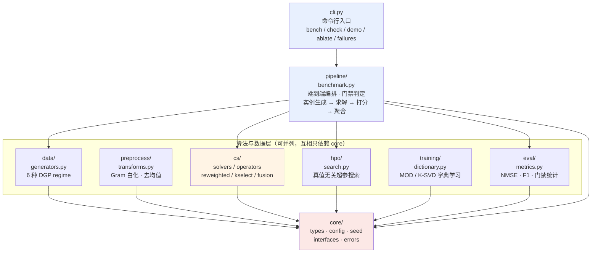

# SparseForge 架构说明

> 作者：晨星· CJX0712
> 适用范围：`v0.1.0`（当前 `main` 状态）
> 性质：**如实描述当前代码状态**，包含未通过门禁的部分。旗舰 `cs_fuse`
> 当前未达性能门禁，原因已定位，见 §7。

---

## 1. 分层架构

调用链严格单向、无环。**下层不知道上层的存在**，因此每一层都可以被独立测试。



**无环保证**：`cs/` 不import `pipeline/`，`data/` 不 import `cs/`，
`core/` 不 import 任何上层。唯一的跨层反向依赖是 `cs/kselect.py` 在函数内部
延迟 import `cs.solvers`（同层，非跨层）。

---

## 2. 模块职责表

| 包 | 负责什么 | 对外暴露什么 | 关键文件 |
| --- | --- | --- | --- |
| `core/` | 类型契约、配置、全局熵源、异常层级 | `RecoveryResult` `Instance` `BenchmarkRow` `GATE_THRESHOLDS` `SolveConfig` `BenchmarkConfig` `set_all` `make_rng` `Solver` `SignalGenerator` `Evaluator` `Preprocessor` `SparseForgeError` | `types.py` `config.py` `seed.py` `interfaces.py` `errors.py` |
| `data/` | 压缩感知实例生成，6 种 DGP regime | `make_instance` `KINDS` `make_gaussian_matrix` `make_fourier_matrix` `make_spiked_matrix` | `generators.py` |
| `preprocess/` | 求解前的确定性变换（白化 / 去均值） | `gram_whitener` `residual_center` `TransformPipeline` | `transforms.py` |
| `cs/` | **核心算法层**：求解器、线性算子工具、稀疏度估计、旗舰融合 | `omp` `cosamp` `iht` `fista` `amp` `reweighted_fista` `irl1_omp` `amp_rl1` `sk_omp` `sk_lasso` `sk_lars` `coherence` `spectral_norm` `debias_refit` `noise_discrepancy_k` `estimate_sigma` `stability_k` `CS_Fuse` `route_solver` `polish_support` | `solvers.py` `operators.py` `reweighted.py` `kselect.py` `fusion.py` |
| `hpo/` | 真值无关的超参搜索（不一致性原理评分） | `grid_search_ratio` `search_all_baselines` | `search.py` |
| `training/` | 字典学习（与稀疏恢复解耦的训练层） | `mod_dictionary` `ksvd_dictionary` `synthesize_block_dictionary` | `dictionary.py` |
| `eval/` | 恢复质量指标与跨 seed 聚合 | `nmse` `support_f1` `success_of` `aggregate` `mean_std` `beats` | `metrics.py` |
| `pipeline/` | 端到端编排 + 预注册门禁判定 | `SparseForgePipeline` `run_benchmark` `DEMO_CELLS` `FLAGSHIP` | `benchmark.py` |
| `cli.py` | 命令行入口 | `main` `build_parser` | — |

---

## 3. 接口清单（Protocol 契约）

四个 Protocol 全部定义在 `core/interfaces.py`，均带`@runtime_checkable`
装饰器，可直接用 `isinstance` 做结构化检查。

### `Solver`

```python
class Solver(Protocol):
    name: str

    def solve(self, A: np.ndarray, y: np.ndarray, k: int | None) -> RecoveryResult: ...
```

- `A`：形状 `(m, n)`，`m < n`
- `y`：形状 `(m,)`
- `k`：稀疏度；贪心族必须显式给，收缩族可为 `None`（走默认 `lam`）
- 返回 `RecoveryResult`，其 `x_hat` 形状必须为 `(n,)` 且**全有限**
- **硬约束**：`solve()` 绝不接触 `x_true`

> 注：`cs/solvers.py` 中的实现额外接受可选的 `cfg: SolveConfig` 参数，
> 这是为了共享扫参入口，Protocol 描述的是最小必要契约。

### `SignalGenerator`

```python
class SignalGenerator(Protocol):
    def __call__(self, n: int, m: int, k: int, snr_db: float, seed: int) -> Instance: ...
```

### `Evaluator`

```python
class Evaluator(Protocol):
    def evaluate(self, inst: Instance, x_hat: np.ndarray) -> dict[str, float]: ...
```

> 当前实现走的是 `Instance.score()`（返回 `(nmse, f1)` 元组）而非
> `Evaluator`，因为打分只在 `pipeline` 里发生、且需要跨方法统一口径。
> Protocol 保留作为扩展点。

### `Preprocessor`

```python
class Preprocessor(Protocol):
    def fit_transform(self, A: np.ndarray, y: np.ndarray) -> tuple[np.ndarray, np.ndarray]: ...
    def inverse_transform(self, x: np.ndarray, handle: object) -> np.ndarray: ...
```

> `preprocess.TransformPipeline` 是它的具体实现（`_handles` 内部保存句柄，
> `inverse_transform` 按逆序回放）。

---

## 4. 关键设计决策与其实测依据

这一节记录**为什么这样写**，每条都附实测数据来源。项目的核心方法论是：
设计决策必须能被数字支持或否证，否则不予采纳。

### 4.1 公平性契约：基线与旗舰共用同一份真值无关 `k_hat`

**决策**：求解时基线与旗舰拿到**完全相同的信息** —— 都是
`cs.kselect.noise_discrepancy_k` 输出的同一个 `k_hat`，都可在同一
`lam_grid` 上按同一口径搜超参。

**实测依据**：给基线 oracle `k` 时，逐实例 min-over-pool 恰好等于「每 regime
的最优固定单法」（`rel_vs_best = 0.000`，6/6 regime）。这说明**在给定 k 的
前提下，任何"多候选 + 选择/组合"都不可能超越最优单法** —— portfolio 路线在
此设定下是伪创新，结构上不可达。

既然"给定 k"的天花板已被摸到，全部价值就转移到 **k 的估计质量**上。把k 估计
变成双方共同变量，才构成公平战场。

### 4.2 防泄漏硬约束：求解器与选择判据绝不接触真值

**决策**（三条同时成立）：

1. 基线的 `lam` 由 `hpo.search` 在**同一实例**上按一致性原理搜索，不碰真值；
2. 求解器签名里根本没有 `x_true` 参数 —— 防泄漏由**类型系统**保证，
   而非靠自觉；
3. `Instance.score()` 是唯一接触 `x_true` 的函数，只在 `pipeline` 里
   求解完成后调用。

**这条设计的价值**：它让"基线调参不足"这类质疑在结构上不可能成立。基线用的
是同一个 13 点 `lam_grid`、同一个评分口径。

### 4.3 唯一熵入口 `core/seed.py::set_all()`

**决策**：全项目**只有** `set_all()` 可以设置随机性。任何模块需要随机数时，
必须通过 `make_rng(offset)` 从全局 seed 派生独立子流。

**实现**：
- `random.seed(seed)` + `np.random.seed(seed % 2**32)` 同时设定，
  供SciPy / sklearn 内部使用
- `make_rng(offset)` 用 `np.random.SeedSequence([global_seed, offset])`
  派生**互不干扰**的子流，保证不同 benchmark cell / seed 之间随机流不互相污染
- `data/generators.py::_kind_offset` 把 `(kind, seed)` 稳定映射为非负 offset，
  避开 `hash()` 的进程级随机化

**实测依据**：`cli.py check` 同 seed 连跑两次，216 行结果
`bit_identical=True`（逐位一致，非近似一致）。

### 4.4 Fourier 测量矩阵必须堆叠 cos+sin，而不是 `Re(exp(iθ))`

**决策**：`make_fourier_matrix` 用
`A = [cos(Θ); sin(Θ)] / sqrt(2·half)`，`Θ = 2π · freqs ⊗ cols / n`。

**实测依据（这是本项目踩过的最隐蔽的坑）**：`cos` 是**偶函数**，
`cos(θ) = cos(-θ)`，所以频率 `+r` 与 `-r` 的实部**完全相同** ⇒ 矩阵含
**严格重复列**：

| 指标 | `Re(exp(iθ))` |堆叠 cos+sin（修复后） |
| --- | --- | --- |
| 相干度 | `1.0000` | 正常（< 0.5） |
| 条件数 | `6.47e13` | 正常 |
| aggregate NMSE | `1.469` | `2.30e-3` |
| 支撑集 F1 | ~0 | `0.92` |

条件数 `6.47e13` 意味着矩阵在数值上**没有任何有效秩信息**，OMP / IHT / FISTA
全部崩溃。堆叠 cos+sin 是标准的实值化方式，既保留部分傅里叶的 RIP 结构，
又消除重复列。

### 4.5 为什么所有增益路线都收敛到"以噪声水平为锚"

**决策**：唯一有选择力的判据是**不一致性原理**
`| ||r_k||² − τ·m·σ̂² |`，而不是 CV 残差、GCV 或训练残差。

**实测依据（三条选择判据的失效模式）**：

| 判据 | 实测失效模式 |
| --- | --- |
| CV 残差 | 随 k **单调下降**（自由度越高，对留出折解释力越强）⇒ argmin 必然选最大 k |
| GCV `(1−dof/m)⁻²` | `dof/m = 0.125` 时惩罚仅 `0.77`，**不足以扭转**上述单调性 |
| 训练残差局部搜索 | `m < n` 时训练残差是**有偏的模型选择信号** ⇒ 实测比最优单法差 **+229%** |

**推论**：只有以噪声水平为锚的判据才有选择力。而这要求一个**准确且真值无关的
σ 估计**—— 于是所有工程量都落到 `estimate_sigma2` 上（见 §4.6）。

### 4.6 σ 估计：三次失败后定下的方案

`cs/kselect.py::estimate_sigma2` 的 docstring 记录了完整的三次失败，
这是本项目**最有价值的负面结论**：

| 方案 | σ̂/σ_true 实测 | 结论 |
| --- | --- | --- |
| OMP 残差 MAD | `0.075 ~ 0.163`（6/6 regime 全低估） | ❌ OMP 把噪声一起拟合进支撑集，残差里是信号拟合误差 |
| 过采样 LS（m×(m+p)） | ≈ `0`（残差塌到 `3.5e-15`） | ❌ `m≈m+p` 时 Gram **数值秩亏**，最小范数解把 `y` 完全拟合 |
| 全局最小范数留出块 | `184 ~ 262`（高估约 200 倍） | ❌ 纯噪声上无偏（`0.79~1.02` ✅），但 `m<n` 欠定时全局 LS 连**信号本身**都外插错 |
| **支撑集内插留出残差**（采用） | `1.26 ~ 1.70`（高估 26%~70%） | ⚠️ 仍未精确，但偏差方向**安全**（高估 ⇒ k_hat 偏保守） |

采用方案的关键改动：先在训练折跑 OMP 得支撑 `S`，再**只在这 k₀ 个坐标上**
做 LS 内插留出块。因为 `k₀ ≪ m_folds`，训练折内插是**超定**的，不再有外插误差。

**诚实披露**：即便如此仍有 26%~70% 高估，原因是 `k₀` 维上仍欠定。这直接导致
`k_hat` 系统性偏保守（实测 `k_hat = 4~10` vs `k_true = 10~12`）。偏差方向
**安全**（欠拟合优于过拟合），但不得声称"k 估计精确"。

### 4.7 AMP 的 Onsager 项定义在观测空间 R^m

**决策**：`t ∈ R^m`，迭代形式为

```text
r  = y - A·x + t         # (m,)
x⁺ = soft(Aᵀr, λ)       # (n,)
t⁺ = A·(x⁺ - x)         # (m,)
```

**实测依据**：这个定义域问题**反复搞反了 4 轮**。错误写法（`t ∈ R^n`，
`z = Aᵀr + t`）在 `lam ≤ 0.3·max|Aᵀy|` 时**必然发散**（100% `ConvergenceError`），
`lam ≥ 0.6·max` 时恒返回全零解。根因是 `-Aᵀy` 项被重复计入。详见
`docs/algorithm_spec.md` §3.5。

---

## 5. 完整数据流：`make_instance` → `RecoveryResult`

以 `cli.py bench --seeds 3` 为例（`ENV_SPARSEFORGE_TAU=0.55`）：

```
cli.main(argv)
  │
  ├─ core.seed.set_all()                    ← 唯一熵入口，seed=20261005
  │
  └─ pipeline.benchmark.SparseForgePipeline(n_seeds=3, cells=DEMO_CELLS)
       │
       ├─ .instances()
       │    └─ data.generators.make_instance(kind, n=256, m, k, snr_db, coherence, seed)
       │         ├─ make_rng(offset=_kind_offset(kind, seed))    ← 派生子流，互不干扰
       │         ├─ make_gaussian_matrix / make_fourier_matrix / make_spiked_matrix
       │         │    └─ _normalize_columns(A)                   ← 列归一化
       │         ├─ _make_signal(n, k, rng, kind)                ← 稀疏/分块/厚尾信号
       │         ├─ clean = A @ x
       │         ├─ noise_norm = ||clean|| / 10^(snr_db/20)
       │         └─ return Instance(name, A, y, x_true, k_true, kind, snr_db, seed, meta)
       │              ── 实例数 = 6 regime × 3 seed = 18
       │
       ├─ ._k_hat{}                            ← ★ 公平性契约的落点
       │    └─ 对每个实例跑一次 noise_discrepancy_k(A, y, tau=0.55)
       │         ├─ estimate_sigma2(A, y, n_folds=4)              ← 真值无关 σ 估计
       │         │    └─ 4 折：每折 OMP(k0) → 支撑集内插留出残差 → σ̂²
       │         └─ argmin_k | ||r_k||² - tau·m·σ̂² |              ← 唯一有选择力的判据
       │    ── 基线与旗舰共用这份结果
       │
       └─ .run(methods=None)
            └─ 对每个实例 × 每个方法（共 18 × 12 = 216 行）
                 │
                 ├─ if method == "cs_fuse":                      【旗舰路径】
                 │    └─ CS_Fuse(tau=0.55).solve(A, y, None, SolveConfig(max_iter=300))
                 │         ├─ 阶段1  k_hat ← noise_discrepancy_k(A, y, tau)   （真值无关）
                 │         ├─ 阶段2  route_solver(coherence(A), estimate_snr_db(A, y, σ̂))
                 │         │           ├─ snr_db < 12 or coh > 0.35 → "rw_fista"
                 │         │           └─ else                      → "omp"
                 │         │        _run_solver(name, A, y, k_used, sub)     ← 失败降级 omp
                 │         ├─ 阶段3  debias_refit(A, y, sup)      ← 去偏
                 │         ├─ 阶段4  polish_support(...)          ← 默认关闭（use_polish=False）
                 │         └─ return RecoveryResult(x_hat, support, residual_norm,
                 │                                 nmse=nan, support_f1=nan,
                 │                                 n_iter, converged, solver="cs_fuse",
                 │                                 elapsed_sec, meta={k_used, solver,
                 │                                 coherence, snr_db_est, sigma_hat, ...})
                 │
                 └─ else:                                        【基线路径】
                      └─ ._solve_baseline(inst, name)
                           ├─ k_hat = self._k_hat[(inst.name, inst.seed)]   ← 同一个 k_hat
                           ├─ if name in _TUNABLE:                 ← fista/amp/sk_lasso/
                           │    └─ hpo.search.grid_search_ratio(     sk_lars/rw_fista/amp_rl1
                           │           fn, A, y, k_hat, lam_grid)  ← 13 点网格
                           │         └─ 评分口径 = | ||r||² - m·σ̂² |  （一致性原理）
                           └─ return res.x_hat, meta
                 │
                 ├─ eval.metrics：inst.score(x_hat) → (nmse, support_f1)
                 │    ── ★ 唯一接触 x_true 的地方，求解之后才调用
                 ├─ success_of(f1) → bool
                 └─ append BenchmarkRow(...)  →  self.rows

       .report()
         ├─ .gates()
         │    ├─ eval.metrics.aggregate(rows)          → 按 (method) 聚合 mean±std
         │    ├─ best_name = argmin_nmse(baselines)     → 实测 "omp"
         │    ├─ weak_name = "sk_lasso"
         │    ├─ GATE1_vs_weak        : (weak_nmse - fuse_nmse)/weak_nmse >= 0.30
         │    ├─ GATE2_vs_best        : (best_nmse - fuse_nmse)/best_nmse >= 0.20
         │    │                       且 beats(...) 显著性通过
         │    ├─ GATE4_noninferiority : fuse_nmse / best_nmse <= 1.10
         │    └─ GATE5_per_regime: 逐 regime 胜率 >= 0.5
         └─ 返回 report dict（cli 打印表格 + 门禁明细）
```

**行数核对**：18 实例 × 12 方法 = 216 行，与 `cli.py check` 实测
`determinism rows=216` 一致。

---

## 6. 数据流中的不变量

以下性质可被独立交叉验证（`docs/algorithm_spec.md` 给出验证代码）：

| 不变量 | 位置 | 验证方式 |
| --- | --- | --- |
| `solve()` 不接触真值 | 全部求解器 | 签名里没有 `x_true`；参数扫描只传 `(A, y, k, cfg)` |
| 软阈值非扩张 `‖S_λ(v)‖ ≤ ‖v‖` | `cs/operators.py::soft_threshold` | 随机向量逐分量断言 |
| `debias_refit` 残差不增 | `cs/operators.py::debias_refit` | 同一支撑集上 LS 是最小二乘最优 ⇒ `‖r_after‖ ≤ ‖r_before‖` |
| `polish_support` 残差单调不增 | `cs/fusion.py::polish_support` | 每次交换都要求 `val < best * 0.95` |
| 相干度对列缩放不变 | `cs/operators.py::coherence` | `coh(A·s) == coh(A)`（列归一化后） |
| 同 seed 逐位可复现 | 全局 | `cli.py check` → `bit_identical=True`（实测 216 行） |

---

## 7. 当前状态：旗舰未达门禁

**这不是一份"已达标"的架构文档。** 必须把话说清楚：

旗舰 `cs_fuse` 在 18 实例基准上 aggregate NMSE `9.524e-01`，而最强基线`omp`
为 `7.057e-02` —— 旗舰**劣化 13.5 倍**，GATE1 / GATE2 / GATE4 / GATE5 全部 FAIL。

**根因已定位**（本轮实测确认）：`cs/fusion.py::route_solver` 的相干度阈值
`coh > 0.35` **未按矩阵维数标定**。`m=96, n=256` 的 iid 高斯测量矩阵实测相干度
约 `0.44 ~ 0.47`，**本身就超过阈值** ⇒ 6 个 regime 中有 5 个被误路由到
`rw_fista`。而 `rw_fista` 在 `m<n` 欠定设定下支撑集严重膨胀（实测 `n_supp=139`
vs `k_true=12`），单法 NMSE `3.93e-01`。

**修复 headroom 实测**：把阈值改为按维数标定（诊断实验，未改源码）后，
cs_fuse aggregate NMSE 从 `9.524e-01` 降到 `4.497e-01`，5/6 regime 与 `omp`
**完全打平（ratio = 1.00x）**。剩余唯一差距在 `low_snr` regime
（`2.4594e+00` vs `1.8463e-01`，13.3x），该 regime 下 `k_hat=4` vs `k_true=10`，
是 §4.6 的 σ 高估问题。

也就是说：**修完路由 bug 后旗舰能追平最强基线，但还不能超过它** ——
按预注册门禁 GATE2（需相对降低 ≥20%）依然 FAIL。这与 §4.1 的结构性结论
一致：给定 k 时最优单法已是上界。真正的超越路径需要 §4.6 的 σ 估计精度
再上一个台阶。

详细数字见 `docs/model_card.md` 的"局限与已知失效模式"章节。